# GSP26SE10-Mobile User Manual

## 3.1 Key Features

- User registration, email verification, password reset, and login, including Google Sign-In.
- Browse services, menus, dishes, and detailed item information.
- Create orders, place deposits, manage the shopping cart, and confirm booking details.
- Real-time chat with service providers and support staff.
- Track order status, view order history, and review transaction history.
- Receive system notifications and push alerts for chat and role-specific updates.
- Submit feedback and ratings for menus and services after completed orders.
- Role-based home screens and management tools for staff and group leaders.

## 3.2 Workflow 1: Authentication

**Purpose:**
To allow users to create a new account or access an existing account in order to fully utilize the application's features.

**Workflow Diagram:**

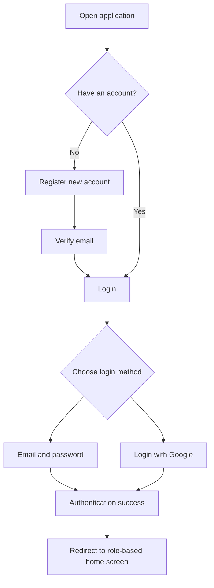

**Detailed Instructions:**

1. Open the application and navigate to the Login screen.
2. Enter your email or username and password.
3. Click the Login button.
4. If you do not have an account, select Register and fill in the required fields.
5. Complete email verification if prompted.
6. You may choose Login with Google instead.
7. If you forget your password, use Forgot Password to request a reset email.
8. After successful authentication, the system will redirect you to the main screen based on your user role.

## 3.3 Workflow 2: Browse Services and Menus

**Purpose:**
To help users explore available services, buffet menus, dishes, and item details before placing an order.

**Workflow Diagram:**

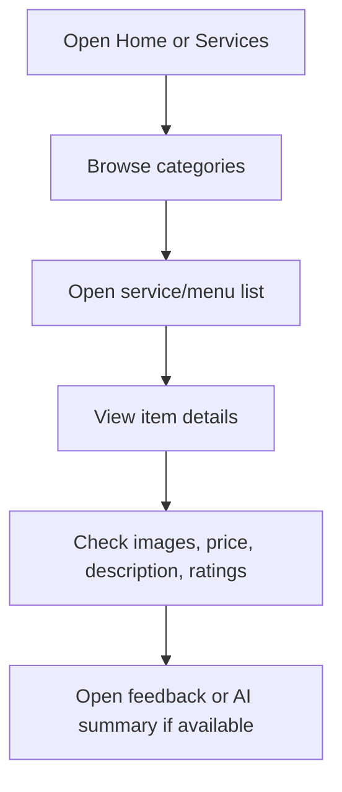

**Detailed Instructions:**

1. Open the Home screen to view featured menu categories.
2. Navigate to Services to browse available services and dishes.
3. Tap a menu or service card to open the detail screen.
4. Review images, pricing, descriptions, AI summaries, and ratings.
5. Tap the feedback area to view customer reviews when available.

## 3.4 Workflow 3: Create an Order and Place a Deposit

**Purpose:**
To let users select menus, services, and dishes, then confirm the booking and pay the deposit.

**Workflow Diagram:**

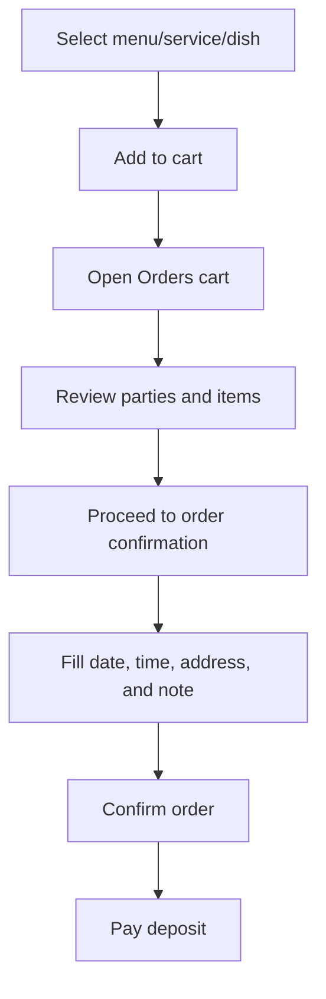

**Detailed Instructions:**

1. Select a menu or service from the list or detail screen.
2. Tap Add to cart to save the item.
3. Open the Orders screen to review the cart.
4. Verify the party information, selected items, and total amount.
5. Continue to Order Confirmation.
6. Enter the event date, start time, end time, address, and any note.
7. Confirm the order and complete the deposit step.

## 3.5 Workflow 4: Manage the Shopping Cart

**Purpose:**
To let users review selected items before final confirmation and keep the booking structure consistent.

**Workflow Diagram:**

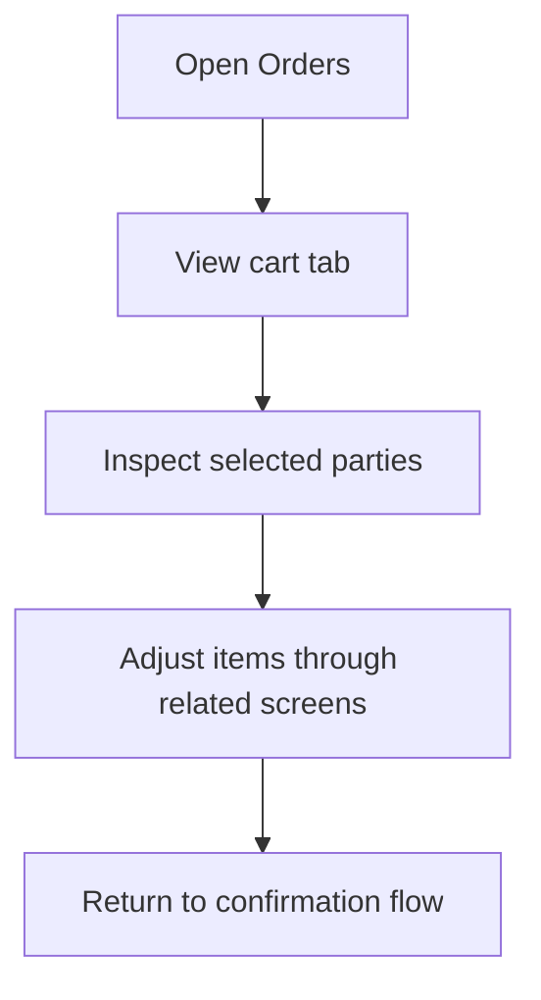

**Detailed Instructions:**

1. Open the Orders tab from the bottom navigation.
2. Review the current cart, including menus, services, and dishes.
3. Open item details if you need to inspect or re-check the selection.
4. Continue to order confirmation when everything is correct.

## 3.6 Workflow 5: Real-Time Chat

**Purpose:**
To allow users to communicate with support or service providers during the booking process.

**Workflow Diagram:**

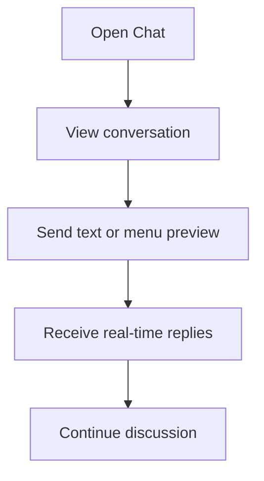

**Detailed Instructions:**

1. Open the Chat screen from the app.
2. View the existing conversation thread.
3. Type a message and send it to the owner.
4. Continue the conversation until the issue or request is resolved.

## 3.7 Workflow 6: Track Orders and Transaction History

**Purpose:**
To help users follow order progress and review completed payments.

**Workflow Diagram:**

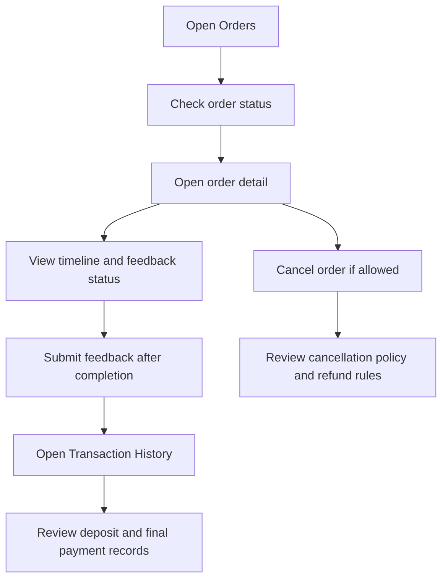

**Detailed Instructions:**

1. Open the Orders screen to see upcoming, ongoing, completed, or cancelled orders.
2. Tap an order to view detailed status information.
3. Check the status timeline and any extra charges.
4. If the order is completed, open the feedback flow from Order Detail to rate the menu or service, write a comment, and attach images if needed.
5. If the order is still eligible for cancellation, tap Cancel Order in Order Detail, enter the cancellation reason, and review the cancellation policy.
6. Refunds are processed according to the policy and the current order status.
7. Open Transaction History from the Account screen to review payment records.
8. Use the history to verify deposits and remaining payments.

## 3.8 Workflow 7: Notifications and Emails

**Purpose:**
To keep users informed about chat activity, order updates, verification, and account-related actions.

**Workflow Diagram:**

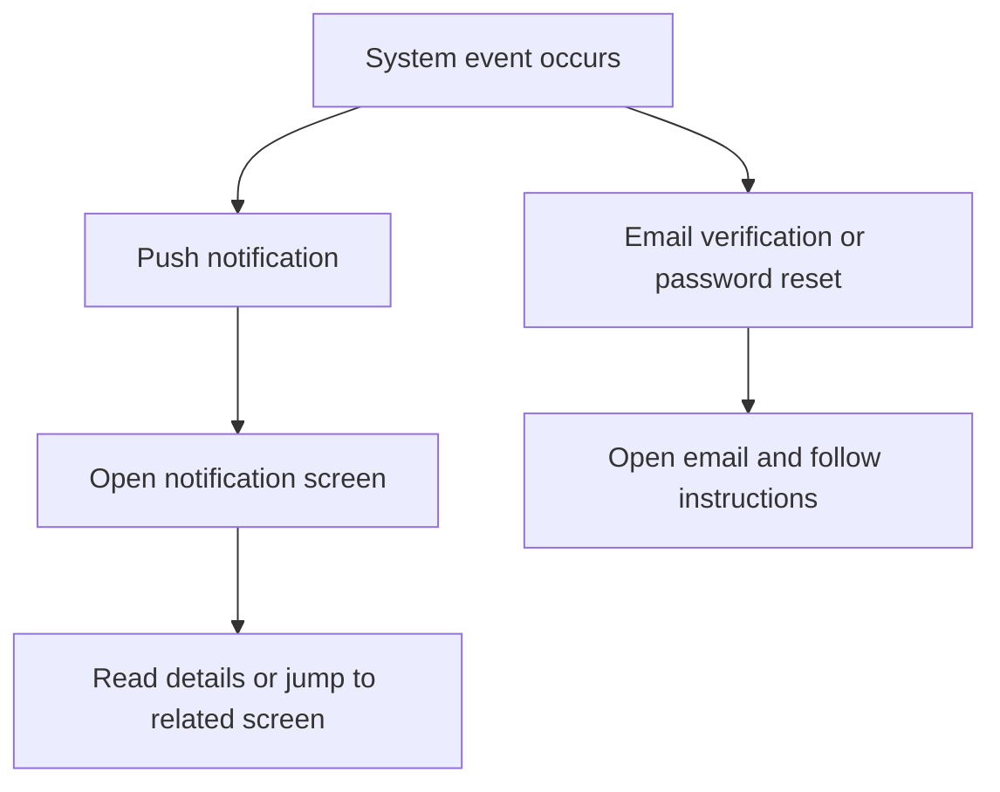

**Detailed Instructions:**

1. When a push notification arrives, open the notification screen to read it.
2. Tap the notification if it links to chat or an order-related page.
3. Check your email for verification or password reset messages.
4. Follow the instructions in the email to complete the action.

## 3.9 Workflow 8: Staff Access and Task Management

**Purpose:**
To allow staff members to review tasks assigned by the group leader, monitor work status, and handle work-related updates after logging in.

**Workflow Diagram:**

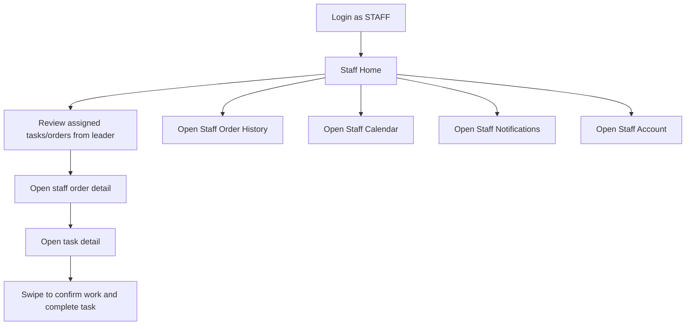

**Detailed Instructions:**

1. Log in using a staff account.
2. After successful authentication, the app redirects to the Staff Home screen.
3. Review the list of tasks assigned by the group leader on the home screen.
4. Tap an order to open Staff Order Detail and inspect customer information, item details, and tasks list.
5. Tap a task to read the task details, work time, and note.
6. Swipe on the task to confirm the work in progress and mark it as completed when finished.
7. Use the Staff Order History screen to review completed orders.
8. Use the Staff Calendar screen to check weekly schedules and planned work assignments.
9. Open Staff Notifications to view staff-specific alerts and task updates.
10. Open Staff Account to review profile information and account options.

## 3.10 Workflow 9: Staff Calendar and Notifications

**Purpose:**
To help staff keep track of work schedules, follow task status updates, and respond to operational alerts in a timely manner.

**Workflow Diagram:**

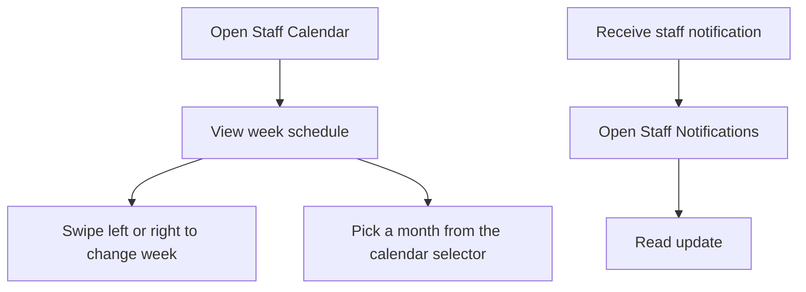

**Detailed Instructions:**

1. Open Staff Calendar from the bottom navigation.
2. Review the current week schedule and event list.
3. Swipe left or right to move to the previous or next week.
4. Select a month from the month picker if you want to jump to another period.
5. If a notification arrives, open Staff Notifications to read the update.
6. Use the notification details to stay aligned with task assignment changes, order changes, or internal announcements.

## 3.11 Workflow 10: Group Leader Oversight

**Purpose:**
To allow the group leader to monitor orders, assign tasks to staff members, add compensation charges if needed, track task progress, and manage leader-specific updates.

**Workflow Diagram:**

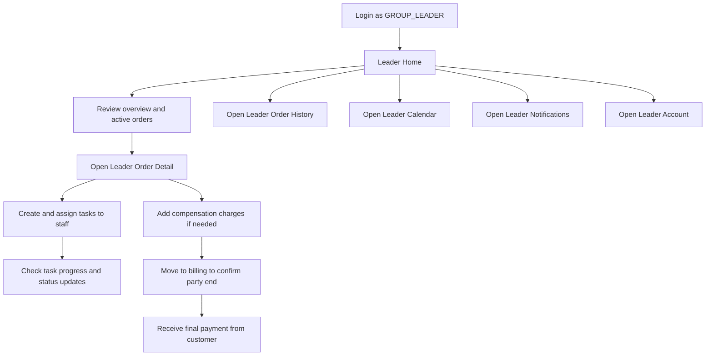

**Detailed Instructions:**

1. Log in using a group leader account.
2. After successful authentication, the app redirects to the Leader Home screen.
3. Review the overview panel, active orders, and group members displayed on the home screen.
4. Tap an order to open Leader Order Detail and inspect the related order information.
5. Create tasks and assign each task to a specific staff member.
6. Check task progress and task status updates after assigning work.
7. If there is damage or an additional cost, add a compensation charge in the order detail screen.
8. Move the party to the billing stage when the event is ready to end.
9. Confirm the final payment for the party and complete the closing process.
10. Use Leader Order History to review previously processed or completed orders.
11. Use Leader Calendar to manage the leader schedule and weekly planning.
12. Open Leader Notifications to read role-specific alerts.
13. Open Leader Account to review profile and account-related information.

## 3.12 Workflow 11: Leader Calendar and Notifications

**Purpose:**
To help the group leader follow the weekly schedule, track task progress, and receive important group notifications.

**Workflow Diagram:**

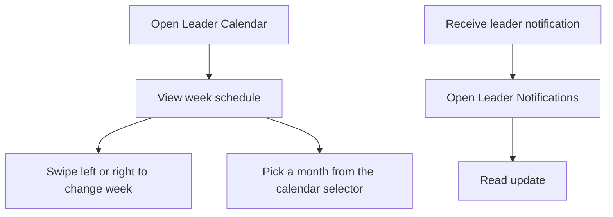

**Detailed Instructions:**

1. Open Leader Calendar from the bottom navigation.
2. Review the weekly schedule and event entries.
3. Swipe horizontally to move between weeks.
4. Select a month from the month picker when you need to jump to another time period.
5. When a new leader notification arrives, open Leader Notifications to view it.
6. Use the notification content to follow group-related updates, task assignment changes, compensation updates, or order changes.

## 3.13 Additional Notes

- Some actions require login. If you are not authenticated, the app redirects you to the Login screen.
- Certain screens are role restricted and appear only for staff or group leaders.
- Order cancellation and refund handling depend on the policy shown on the website.
